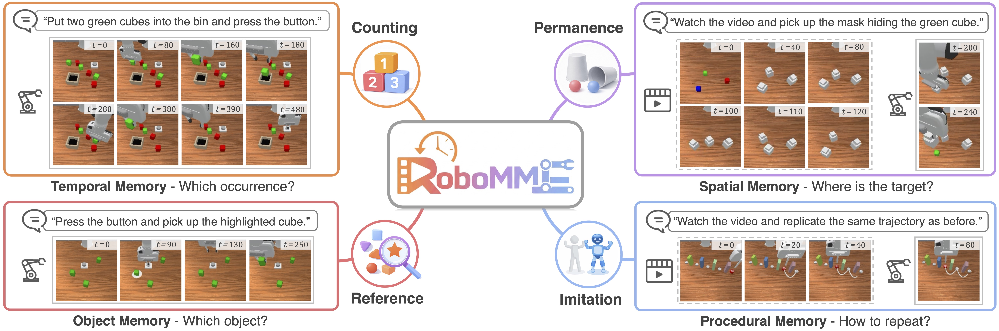

# RoboMME: A Robotic Benchmark for Memory-Augmented Manipulation

### [Website](https://robomme.github.io/) | [Paper](https://arxiv.org/abs/2603.04639) | [MME-VLA Policy Learning](https://github.com/RoboMME/robomme_policy_learning) | [Dataset](https://huggingface.co/datasets/Yinpei/robomme_data_h5) |  [Models](https://huggingface.co/Yinpei/mme_vla_suite) | [Leaderboard](https://robomme.github.io/leaderboard.html) | [Demo](https://huggingface.co/spaces/HongzeFu/RoboMME)

### 🚀 Join Our Community: [Wechat Group](doc/Wechat.jpg) | [Discord](https://discord.gg/mGYRqFGz)


## 📢 Announcements

[05/2026] 🎉 RoboMME has been selected for ICML 2026 Oral presentation (Top 0.7%)!   
[04/2026] 🎉 RoboMME has been accepted to ICML 2026 as a Spotlight (Top 2.2%)!  
[03/2026] 🚀 RoboMME Challenge is live at CVPR 2026! 🤖 Check our [website](https://robomme.github.io/challenge.html) and the [`challenge_interface`](challenge_interface) directory for all the details. Let’s build stronger memory-augmented robotic generalists together! 💪  
[03/2026] We added Docker support for installation.  
[03/2026] We launched [Wechat](doc/Wechat.jpg) and [Discord](https://discord.gg/xbmSqMd4) channels for discussion and collaboration.   
[03/2026] 🎉 We are thrilled to release RoboMME, the first large-scale robotic benchmark dedicated to memory-augmented manipulation! Spanning 4 cognitively motivated task suites with 16 carefully designed tasks, RoboMME pushes robots to remember 🧠, reason 💭, and act ⚡.

## 📦 Installation

(1) Using `uv`  
After cloning the repo, install [uv](https://docs.astral.sh/uv/getting-started/installation/), then:

```bash
uv sync
uv pip install -e .
```

(2) Using Docker  
Build the image:

```bash
docker build -t robomme:cuda12.8 .
```

Run an interactive shell (videos/logs will be written to the host path `./runs`):

```bash
docker run --rm -it --gpus all \
  -e NVIDIA_DRIVER_CAPABILITIES=compute,graphics,utility,video \
  -v "$PWD/runs:/app/runs" \
  robomme:cuda12.8
```

More Docker options (mounting datasets, troubleshooting, etc.) are in [doc/docker_installation.md](doc/docker_installation.md).

## 🚀 Quick Start

Start an environment with a specified setup:

```bash
uv run scripts/run_example.py
```

This generates a rollout video in the `sample_run_videos` directory.

We provide four action types: `joint_angle`, `ee_pose`, `waypoint`, and `multi_choice`. For example, you can predict continuous absolute actions with `joint_angle` or `ee_pose`, discrete waypoint actions with `waypoint`, or use `multi_choice` for VideoQA-style problems.

## 📁 Benchmark

### 🤖 Tasks

We have four task suites, each with 4 tasks:

| Suite      | Focus             | Task ID                                                                 |
| ---------- | ----------------- | --------------------------------------------------------------------- |
| Counting   | Temporal memory   | BinFill, PickXtimes, SwingXtimes, StopCube                            |
| Permanence | Spatial memory    | VideoUnmask, VideoUnmaskSwap, ButtonUnmask, ButtonUnmaskSwap         |
| Reference  | Object memory     | PickHighlight, VideoRepick, VideoPlaceButton, VideoPlaceOrder         |
| Imitation  | Procedural memory | MoveCube, InsertPeg, PatternLock, RouteStick                          |

All tasks are defined in `src/robomme/robomme_env`. A detailed description can be found in our paper's appendix.

### 📥 Training Data

Training data can be downloaded [here](https://huggingface.co/datasets/Yinpei/robomme_data_h5). There are 1,600 demonstrations in total (100 per task). The HDF5 format is described in [doc/h5_data_format.md](doc/h5_data_format.md).

After downloading, replay the dataset for a sanity check:

```bash
uv run scripts/dataset_replay.py --h5-data-dir <your_downloaded_data_dir>
```

### 📊 Evaluation

To evaluate on the test set, set the `dataset` argument of `BenchmarkEnvBuilder`:

```python
task_id = "PickXtimes"
episode_idx = 0
env_builder = BenchmarkEnvBuilder(
    env_id=task_id,
    dataset="test",
    ...
)

env = env_builder.make_env_for_episode(episode_idx)
obs, info = env.reset() # initial step
task_goal = info['task_goal'][0]
...
obs, _, terminated, truncated, info = env.step(action) # each step
```
The train split has 100 episodes. The val/test splits each have 50 episodes. All seeds are fixed for benchmarking.

The environment input/output format is described in [doc/env_format.md](doc/env_format.md).

> Currently, environment spawning is set up only for imitation learning. We are working on extending it to support more general parallel environments for reinforcement learning in the future.
<!-- 
### 🔧 Data Generation

You can also re-generate your own HDF5 data via parallel processing using
@hongze
```bash
uv run scripts/dev/xxxx
``` -->


## 🎓 Model Training

### 🌟 MME-VLA-Suite

The [MME Policy Learning](https://github.com/RoboMME/robomme_policy_learning) repo provides the MME-VLA training and evaluation code used in our paper. It contains a family of 14 memory-augmented VLA models built on the [pi05](https://github.com/Physical-Intelligence/openpi) backbone.

### 📚 Prior Methods

**MemER**: The [MME Policy Learning](https://github.com/RoboMME/robomme_policy_learning) repo also provides our implementation of the [MemER](https://jen-pan.github.io/memer/), using the same GroundSG policy model as in MME-VLA.

**SAM2Act+**: The [RoboMME_SAM2Act](https://github.com/RoboMME/SAM2Act) repo provides our implementation adapted from the [SAM2Act](https://github.com/sam2act/sam2act) repo.

**MemoryVLA**: The [RoboMME_MemoryVLA](https://github.com/RoboMME/MemoryVLA) repo provides our implementation adapted from the [MemoryVLA](https://github.com/shihao1895/MemoryVLA) repo.
 
**Diffusion Policy**: The [RoboMME_DP](https://github.com/RoboMME/DP) repo provides our implementation adapted from the [diffusion_policy](https://github.com/real-stanford/diffusion_policy) repo.

**OpenVLA-OFT**: The [RoboMME_OpenVLA-OFT](https://github.com/RoboMME/OpenVLA-OFT) repo provides our implementation adapted from the [OpenVLA-OFT](https://github.com/moojink/openvla-oft) repo.


## 🏆 Submit Your Models
Want to add your model? Download the [dataset](https://huggingface.co/datasets/Yinpei/robomme_data_h5) from Hugging Face, run evaluation using our [eval scripts](scripts/evaluation.py), then submit a PR with your results by adding `<your_model>.md` to the `doc/submission/` [directory](https://github.com/RoboMME/robomme_benchmark/tree/main/doc/submission). We will review it and update our leaderboard.


## 🔧 Troubleshooting

**Q1: RuntimeError: Create window failed: Renderer does not support display.**

A1: Use a physical display or set up a virtual display for GUI rendering (e.g. install a VNC server and set the `DISPLAY` variable correctly).

**Q2: Failure related to Vulkan installation.**

A2: Please refer to the ManiSkill [solution](https://maniskill.readthedocs.io/en/latest/user_guide/getting_started/installation.html#vulkan). If it still does not work, we recommend reinstalling the NVIDIA driver and Vulkan packages. We use NVIDIA driver 570.211.01 and Vulkan 1.3.275. You can also switch to CPU rendering:
```
os.environ['SAPIEN_RENDER_DEVICE'] = 'cpu'
os.environ['MUJOCO_GL'] = 'osmesa'
```
Alternatively, you can install RoboMME via Docker by following the [instructions](doc/docker_installation.md).

**Q3: I want to participate in the RoboMME Challenge. How should I get started?** 

A3: We are finalizing the submission instructions and will announce details by the end of March. In the meantime, you can get started by exploring the benchmark repository and the [MME-VLA policy learning repo](https://github.com/RoboMME/robomme_policy_learning/tree/main); the challenge will use held-out test episodes similar to the standard [test episodes](https://github.com/RoboMME/robomme_benchmark/tree/main/src/robomme/env_metadata/test), but not publicly accessible during the competition.


## 🙏 Acknowledgements

This work was supported in part by NSF SES-2128623, NSF CAREER #2337870, NSF NRI #2220876, NSF NAIRR250085, NSF IIS-1949634. We would also like to thank the wonderful [ManiSkill](https://github.com/haosulab/ManiSkill) codebase from UCSD Hao Su's lab.


## 📄 Citation

```
@article{dai2026robomme,
  title={RoboMME: Benchmarking and Understanding Memory for Robotic Generalist Policies},
  author={Dai, Yinpei and Fu, Hongze and Lee, Jayjun and Liu, Yuejiang and Zhang, Haoran and Yang, Jianing and Finn, Chelsea and Fazeli, Nima and Chai, Joyce},
  journal={arXiv preprint arXiv:2603.04639},
  year={2026}
}
```
