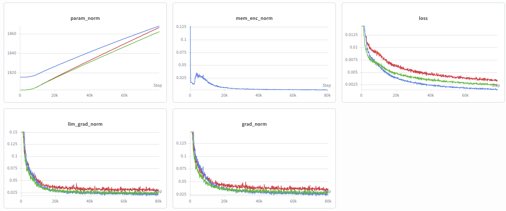

# Training Loss Curve

The plot below compares the training loss of:
1. `pi05` baseline (red)
2. `GroundSG` (green)
3. `FrameSamp+Modul` (blue)

After 80k iterations, the expected training losses are approximately `0.003`, `0.0025`, and `0.0015` for `pi05` baseline, `GroundSG`, and `FrameSamp+Modul`, respectively. The loss curves of other MME-VLA variants are similar.